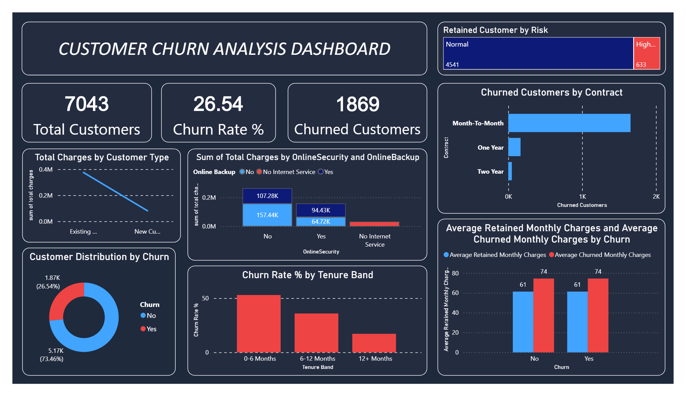

# Customer Churn Analysis

## Dashboard Preview

## Project Overview
This project presents an end-to-end Customer Churn Analysis using Power BI. The objective is to identify the key factors contributing to customer churn and provide actionable business insights to improve customer retention.

## Tools & Technologies
- Power BI
- Power Query
- DAX
- Data Visualization

## Dataset
The project uses the Telco Customer Churn dataset. Data cleaning and transformation were performed using Power Query within Power BI.

## Dashboard Features
- Customer Churn Rate
- Customer Demographics
- Contract Type Analysis
- Payment Method Analysis
- Internet Service Analysis
- Monthly Charges Analysis
- Interactive Filters and KPIs

## Key Insights
- Customers with month-to-month contracts have the highest churn.
- Higher monthly charges are associated with increased churn.
- Long-term contracts improve customer retention.

## Files
- `Churn_analysis_proje_dashboard.pbix` – Power BI dashboard
- `telco_churn_unclean.csv` – Raw dataset
